# keysound-ai

**Klingen einzelne Tasten unterschiedlich genug, dass ein kleines neuronales
Netz sie am Geräusch auseinanderhalten kann?**

<p align="center"></p>

Ein Labor für Tastenakustik: Du nimmst deine eigenen Tastenanschläge auf,
wählst bis zu 40 Tasten, trainierst ein kleines neuronales Netz darauf und
testest es live gegen deine eigene Tastatur. Alles läuft lokal, nichts geht ins
Netz, und am Ende steht eine Zahl, die du selbst gemessen hast.

> **Mit KI-Unterstützung entstanden.** Idee, Experiment, Aufnahmen und
> Messungen sind von mir. Den Code habe ich teils selbst geschrieben, teils
> gemeinsam mit **Claude** (Anthropic) erarbeitet – ebenso diese Doku. Die
> Zahlen hier sind echt gemessen; der Code ist da, rechne es nach.

---

## Was es kann

* **Beliebige Tasten:** 2 bis 40 Zeichen, frei wählbar – vier Tasten für den
  schnellen Test, die Grundreihe, die Ziffern oder das ganze Alphabet.
* **So viele Daten, wie du willst:** geführter Aufnahmemodus, beliebig viele
  Sitzungen, jede mit einer Rolle (Training, Validierung, Test).
* **Qualität vor dem Training:** Pegel, Rauschabstand, Übersteuerung – und ein
  Trennbarkeitstest, der schon vorher zeigt, ob Struktur in den Daten steckt.
* **Training mit Live-Kurve:** Fehler und Trefferquote wachsen mit, am Ende
  stehen beste Validierung, schwächste Klassen und das gespeicherte Modell.
* **Live-Demo:** findet Anschläge allein im Audiosignal und zeigt, was das
  Modell hört.
* **Grafiken im Hochformat:** alle Ergebnisse als 1080 × 1920 – fertig für
  Shorts, Reels und TikTok.
* **Ehrlich gemessen:** Training, Validierung und Test werden nach ganzen
  Sitzungen getrennt, nie nach einzelnen Proben.

<p align="center">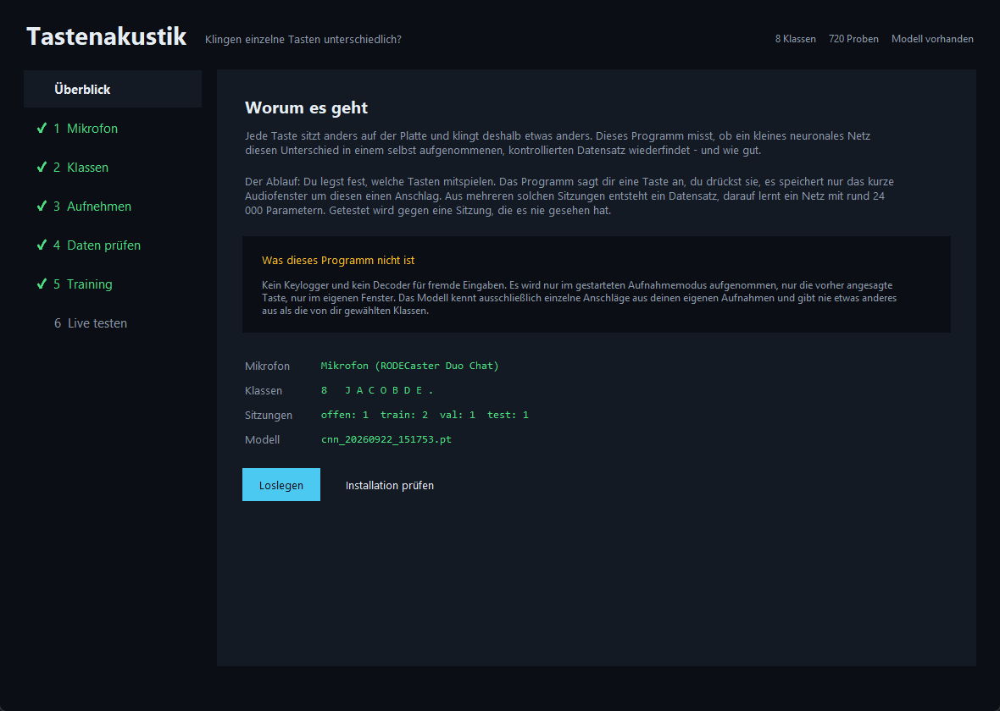</p>

---

## Was dabei herauskam

Meine Referenzmessung, damit du weißt, worauf du dich einlässt. Acht Klassen
(`J A C O B D E .`), ein Kondensatormikrofon rund 30 cm neben der Tastatur,
fünf Aufnahmesitzungen an einem Tag.

<p align="center">
  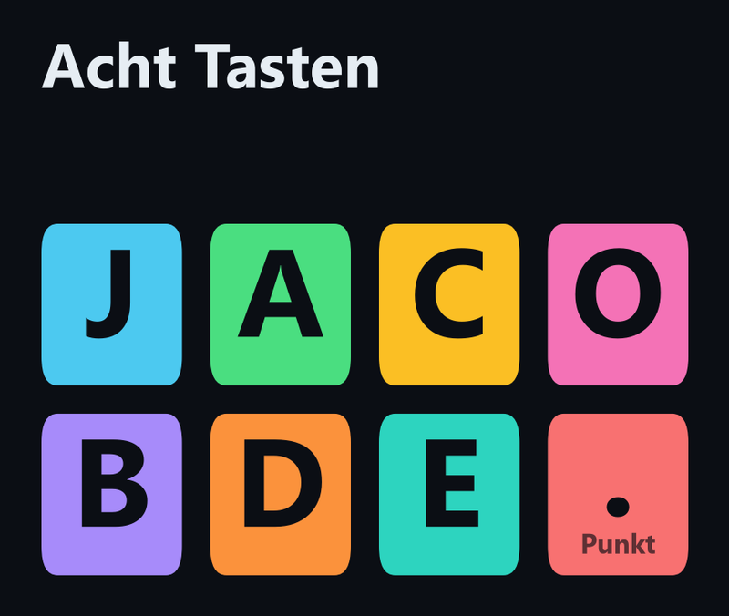
  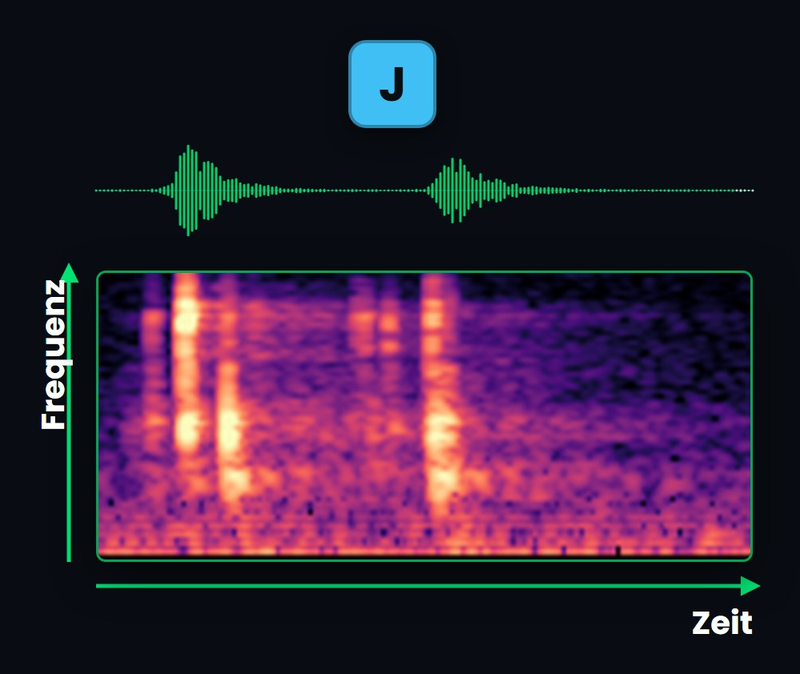
  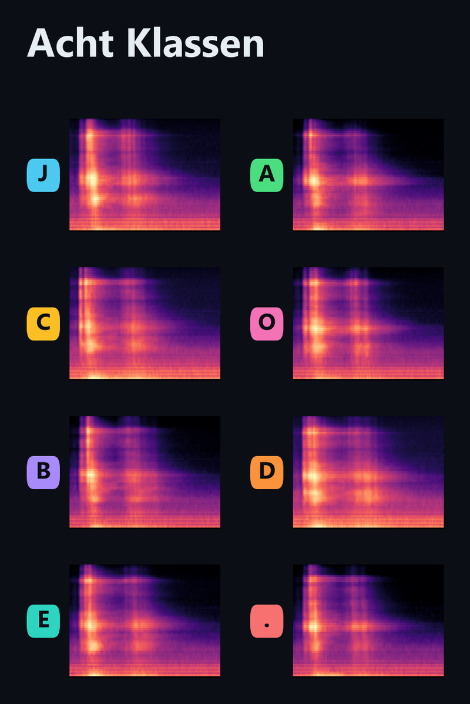
</p>

| | |
|---|---|
| Trainingsdaten | 440 Anschläge (2 Sitzungen) |
| Validierung | 120 Anschläge (1 Sitzung) |
| Test | 120 Anschläge (1 spätere Sitzung) |
| Modell | 23 928 Parameter, 80 Epochen, 61 Sekunden auf der CPU |
| Zufall | 12,5 % |
| **Beste Validierung** | **99,2 %** |
| **Test, ungesehene Sitzung** | **88,3 %** |
| Live getippt, flüssig | nahe Zufall |

<p align="center">
  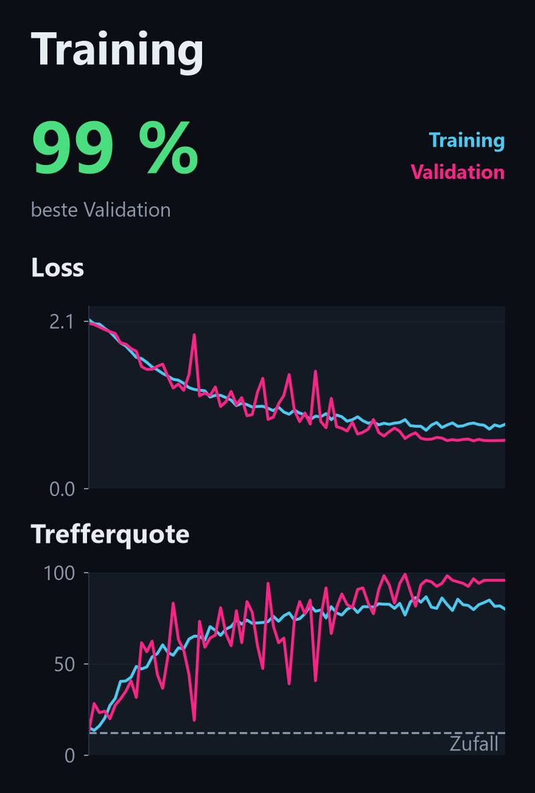
  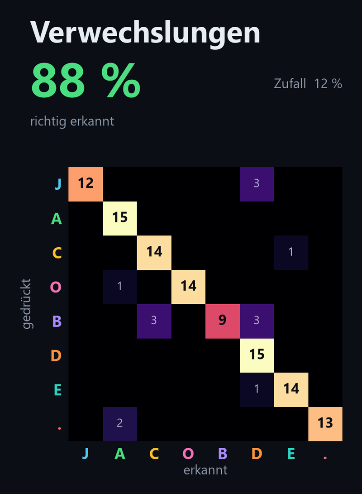
  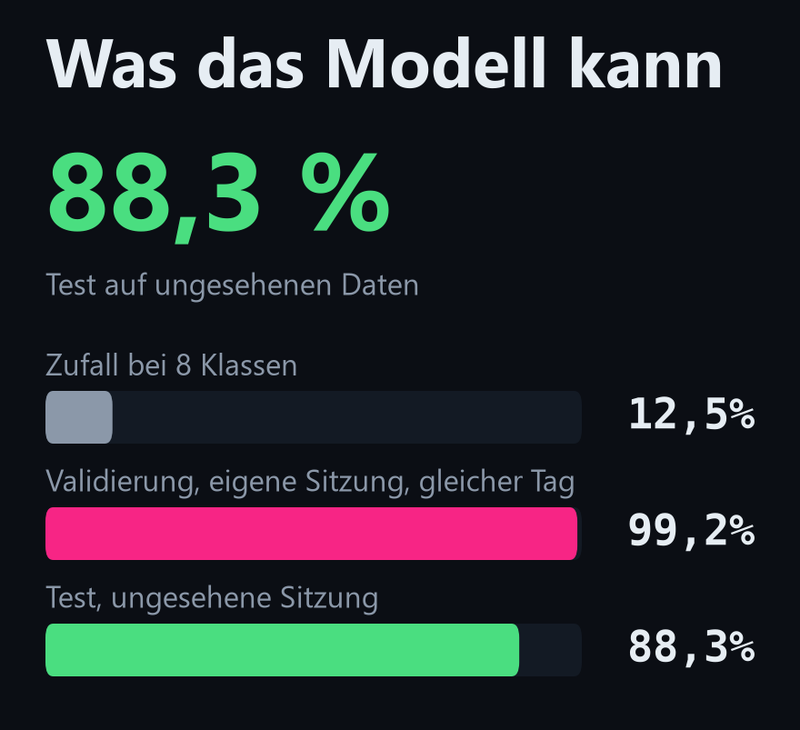
</p>

Die drei Zahlen zusammen sind die eigentliche Geschichte:

**99,2 % sind geschönt.** Die Validierungssitzung entstand am selben Tag, in
derselben Haltung, im selben Raumklang. Das Modell erkennt da zu einem guten
Teil den Nachmittag wieder, nicht nur die Taste.

**88,3 % sind die ehrliche Zahl.** Die Testsitzung lag rund 37 Minuten nach dem
Training und war beim Trainieren nie sichtbar. Der Abstand zu 99,2 % – etwa elf
Prozentpunkte – ist der Preis dafür, dass sich in einer guten halben Stunde
Handhaltung, Sitzposition und Raum leicht verschieben. Wer an einem anderen Tag
testet, wird noch etwas mehr verlieren.

**Flüssiges Tippen scheitert.** Wenn ich ein Wort normal schnell tippe, fällt
die Trefferquote auf Zufallsniveau. Das Modell hat nie gelernt, wie Tippen
klingt: In den Trainingsdaten lag rund eine Sekunde zwischen zwei Anschlägen,
jeder einzeln und sauber freistehend. Beim echten Tippen überlappen Anschlag,
Loslassen und der nächste Anschlag.

Einzelne Klassen im Test: `A` und `D` 100 %, `C`, `O` und `E` je 93 %, `.` 87 %,
`J` 80 %, `B` 60 %. Das `B` liegt auf meiner Tastatur in der untersten Reihe
nahe der Gehäusekante und klingt dumpfer – es wandert regelmäßig zum `E`.

Kurz: Der Effekt ist real und deutlich messbar. Ein Passwortknacker ist er nicht.

---

## Was das hier ist – und was nicht

**Ist es:** Ein kontrolliertes Experiment über den Klang einzelner Tastendrücke,
auf deiner eigenen Tastatur, mit deinen eigenen Aufnahmen. Ein Werkzeug zum
Messen und zum Zeigen.

**Ist es nicht:** Kein Keylogger, kein Decoder für fremde Eingaben, kein
Werkzeug, um Passwörter zu rekonstruieren oder mitzulesen, was jemand schreibt.

Das sind nicht nur gute Vorsätze, das steckt in der Bauweise:

* **Aufgenommen wird nur im ausdrücklich gestarteten Aufnahmemodus.** Läuft er
  nicht, hört das Programm nichts mit.
* **Tastendrücke kommen aus dem Fensterereignis des Collectors**, nicht aus
  einem globalen Hook. Ist sein Fenster nicht im Vordergrund, pausiert die
  Aufnahme von selbst.
* **Gespeichert wird nur das kurze Fenster um einen angekündigten Anschlag.**
  Das Programm sagt dir die Taste an; drückst du eine andere, wird nichts
  gespeichert, nichts gezählt, nichts protokolliert.
* **Das Modell kann nichts anderes ausgeben als deine Klassen.** Die letzte
  Schicht hat genau so viele Ausgänge, wie du Zeichen festgelegt hast. Das ist
  keine Einstellung, das ist die Form des Netzes.
* **Die Live-Demo liest überhaupt keine Tastatur-Ereignisse.** Sie findet
  Anschläge allein im Audiosignal. Es gibt in diesem Programm keine Stelle, an
  der die tatsächlich gedrückte Taste bekannt wäre.
* **Freies Text-Decoding ist nicht implementiert.** Das Modell kennt einzelne
  Anschläge, keine Wörter und keine Sprache.

Nimm nur auf, was du selbst tippst, auf deiner eigenen Tastatur, mit deinem
eigenen Mikrofon. Alles andere ist nicht der Zweck dieses Programms und
vielerorts auch nicht legal.

---

## Installation

Gebraucht wird Python 3.10 oder neuer und ein Mikrofon.

```bash
git clone https://github.com/JacobMenge/keysound-ai.git
cd keysound-ai
python -m venv .venv
```

Umgebung aktivieren – Windows:

```bash
.venv\Scripts\activate
```

macOS und Linux:

```bash
source .venv/bin/activate
```

Dann die Abhängigkeiten:

```bash
pip install -r requirements.txt
```

Ob alles sitzt, sagt dir der Selbsttest. Er braucht kein Mikrofon, erzeugt
künstliche Anschläge, trainiert damit kurz und rendert jede Grafik:

```bash
python werkzeuge/09_selbsttest.py
```

Läuft der durch, läuft auch der Rest.

---

## So arbeitest du damit

```bash
python start.py
```

Unter Windows tut es auch ein Doppelklick auf `start.bat` – das nimmt die
`.venv` im Projektordner, falls es eine gibt, und lässt das Fenster bei einem
Fehler offen stehen.

Ein Fenster, sechs Schritte. Jeder sagt dir, was er braucht, und schaltet den
nächsten frei; erledigte Schritte bekommen links einen grünen Haken.

> Startet gar nichts, sondern kommt eine Meldung über fehlende Pakete: Dann
> läuft ein anderes Python als das, in dem du installiert hast. Die Meldung
> nennt beides – den Interpreter und die vier Zeilen, mit denen du eine eigene
> Umgebung anlegst.

### 1 · Mikrofon

Wähle deinen Eingang. Der Knopf *2 Sekunden mithören* misst Spitzenpegel und
Rauschboden, während du ein paar Mal tippst. Über 25 dB Abstand ist gut, unter
15 dB wird es schwierig. Näher ran hilft am meisten. Unter Windows taucht
dasselbe Gerät mehrfach auf (WASAPI, WDM-KS, …) – im Zweifel **WDM-KS**
nehmen, siehe [Wenn etwas nicht klappt](#wenn-etwas-nicht-klappt).

<p align="center">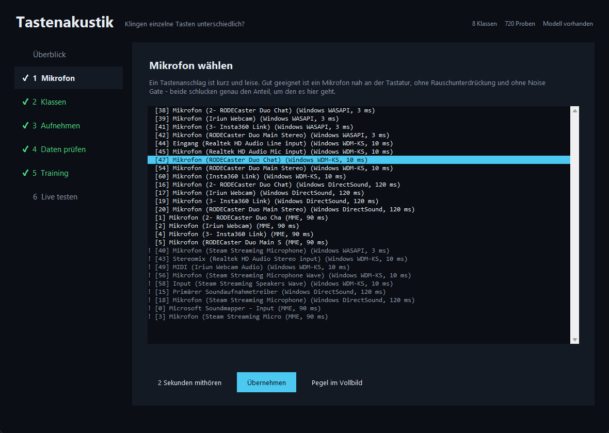</p>

### 2 · Klassen

Welche Tasten soll das Modell unterscheiden? Zwei bis vierzig Zeichen, frei
wählbar. Vorlagen gibt es für die Grundreihe, vier Tasten, die Ziffern und das
ganze Alphabet – du kannst aber auch einfach `qwerz.` eintippen. Darunter
stellst du ein, wie viele Proben du je Klasse aufnehmen willst.

<p align="center">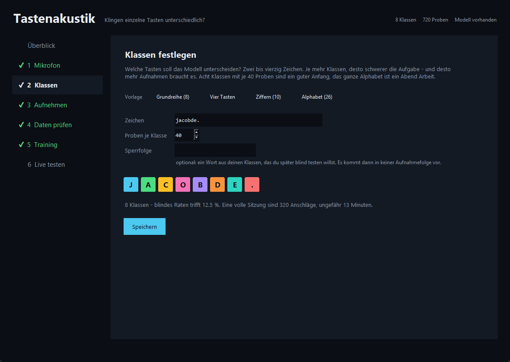</p>

### 3 · Aufnehmen

Der Collector geht im Hochformat auf, sagt dir eine Taste an, du drückst sie.
Das dauert. Nimm mindestens drei Sitzungen auf und gib ihnen danach Rollen:
`train` zum Lernen, `val` zum Mitprüfen, `test` für die ehrliche Zahl. **Die
Testsitzung nimmst du am besten an einem anderen Tag auf** – nur dann misst sie
wirklich die Taste und nicht den Raum von heute Nachmittag.

<p align="center">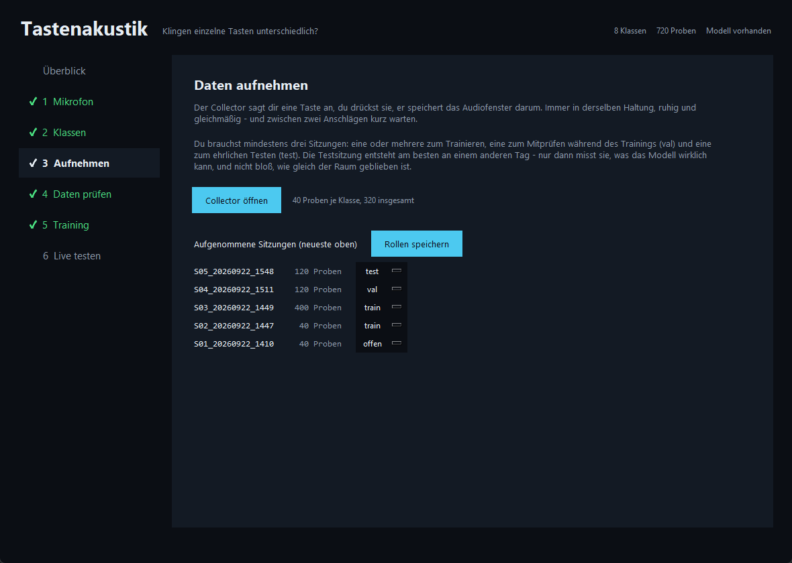</p>

### 4 · Daten prüfen

Sind die Aufnahmen brauchbar? *Prüfen* checkt Pegel, Abstand zum Rauschen,
Übersteuerung und ob eine Rauschunterdrückung dazwischengefunkt hat.
*Trennbarkeit messen* verrät dir schon vor dem Training, ob überhaupt Struktur
in den Daten steckt – ganz ohne neuronales Netz, mit einem einfachen
Nächster-Schwerpunkt-Test.

<p align="center">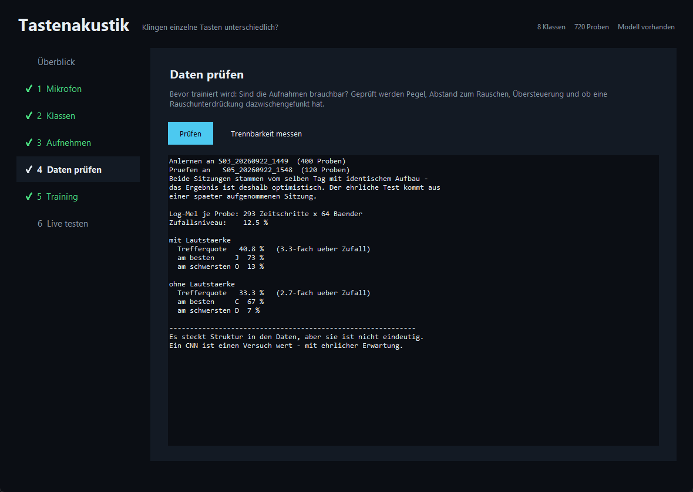</p>

### 5 · Training

Epochenzahl wählen, starten, zusehen. Fehler und Trefferquote wachsen live
mit, die gestrichelte Linie ist das Zufallsniveau. Am Ende stehen die beste
Validierung, die schwächsten Klassen und der Pfad zum Modell. Auf Wunsch
fallen alle Grafiken im Hochformat (1080 × 1920) heraus.

*Auf Testsitzung prüfen* holt dann die ehrliche Zahl: Das fertige Modell wird
gegen deine `test`-Sitzung gerechnet, die weder beim Lernen noch bei der Wahl
des besten Stands mitgespielt hat. Das Ergebnis landet zusätzlich in
`daten/modelle/test_ergebnis.json`.

<p align="center">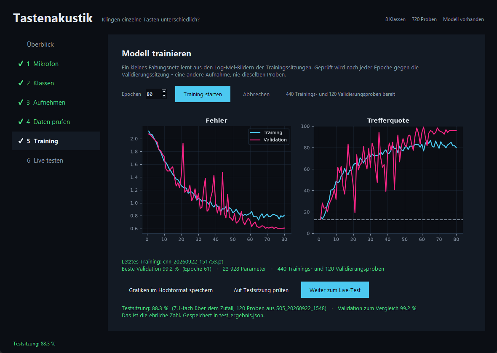</p>

### 6 · Live testen

Die Demo geht auf und hört zu. Tippe einzeln, mit einer kleinen Pause, und
sieh zu, wie sich die Zeichenfolge aufbaut. Optional kannst du einen
Vergleichstext hinterlegen; der wird erst *nach* der Klassifikation
herangezogen und beeinflusst die Vorhersage an keiner Stelle.

Bedient wird die Demo nur mit der Maus – über die Knöpfe unter dem Bild oder
mit einem Rechtsklick ins Bild, der auch im Bühnenmodus ohne Knopfleiste
funktioniert. Die Tastatur bleibt damit komplett frei: Jede Taste, die du
drückst, ist ein Testanschlag und löst sonst nichts aus. Dasselbe gilt für die
Pegelanzeige aus Schritt 1.

<p align="center">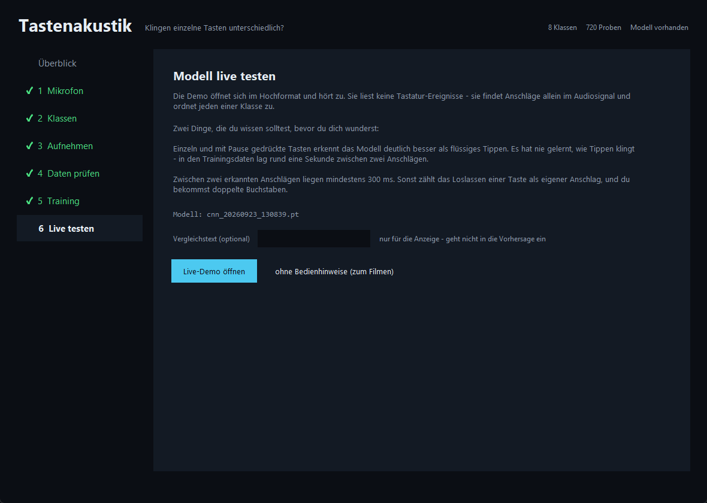</p>

---

## Wie es funktioniert

Der Weg von einem Anschlag zu einer Wahrscheinlichkeit, in sechs Stationen.

<p align="center">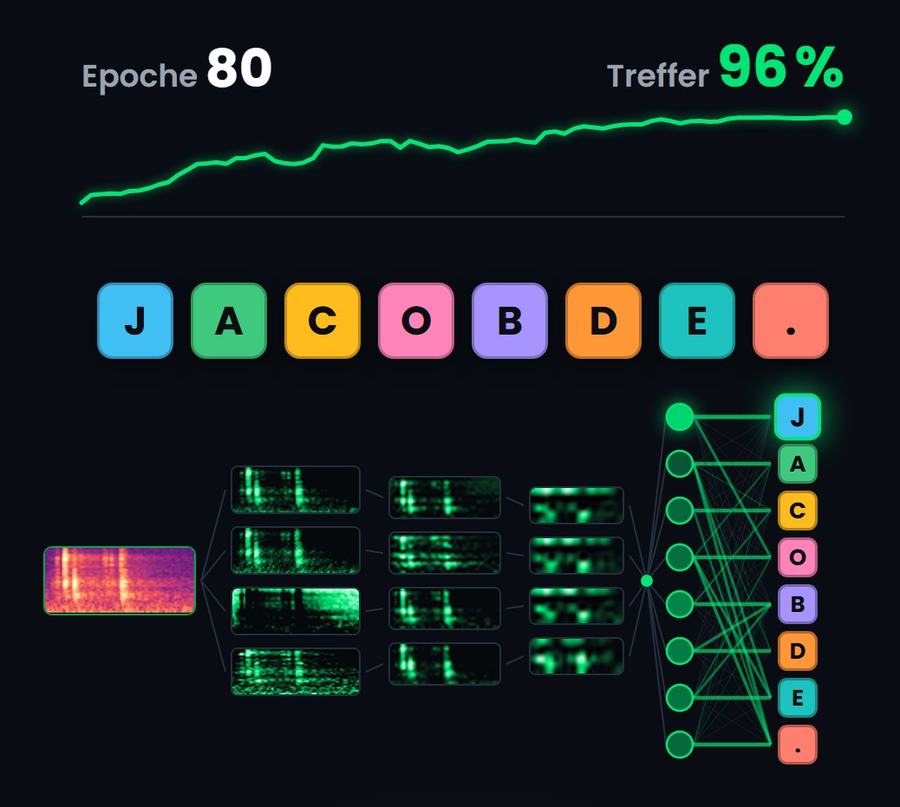</p>

**1 · Ringpuffer.** Im Aufnahmemodus laufen die letzten sechs Sekunden
Mikrofonsignal im Arbeitsspeicher mit. Auf die Platte kommt nichts davon – nur
das kurze Fenster um einen bestätigten Anschlag, 200 ms davor bis 400 ms
danach.

**2 · Onset nachmessen.** Der Zeitstempel eines Tastatur-Ereignisses ist nur auf
ein paar Millisekunden genau; das Betriebssystem meldet den Tastendruck 14 bis
16 ms nach dem Geräusch. Deshalb wird großzügig gefenstert und der eigentliche
Anschlag akustisch nachgemessen: Hochpass bei 1,2 kHz, Kurzzeit-Effektivwert
als Hüllkurve, Rauschboden als 20. Perzentil, und vom lautesten Punkt rückwärts
bis knapp über den Rauschboden. Geschnitten wird ab dem gemessenen Onset, nicht
ab dem Tastendruck.

**3 · Qualität prüfen.** Zu leise, übersteuert, oder mehr als ein Anschlag im
Fenster – dann fliegt die Probe raus, bevor sie gespeichert wird.

**4 · Log-Mel-Spektrogramm.** 250 ms ab 15 ms vor dem Onset werden in 64
Mel-Bänder zwischen 100 Hz und 16 kHz umgerechnet. Aus dem Geräusch wird ein
Bild. Jede Probe wird auf eigenen Mittelwert und eigene Streuung normiert –
damit fällt die Lautstärke heraus und mit ihr die Frage, wie fest jemand
gerade gedrückt hat. Übrig bleibt die Klangfarbe.

**5 · Ein kleines CNN.** Drei Faltungsblöcke (16/32/64 Kanäle) mit
Batch-Normalisierung und Max-Pooling, danach ein Mittelwert über die Zeit,
Dropout und eine lineare Schicht auf so viele Ausgänge, wie du Klassen hast.
Rund 24 000 Parameter bei acht Klassen. Bewusst klein: Ein paar hundert
Trainingsproben sind wenig, ein großes Netz würde sie schlicht auswendig
lernen. Beim Training wird augmentiert – Zeitversatz, Zeit- und
Frequenzmasken, etwas Rauschen.

**6 · Aufteilen ohne Selbstbetrug.** Train, Validierung und Test werden nach
**ganzen Sitzungen** getrennt, nie nach einzelnen Proben. Das ist der wichtigste
Punkt im ganzen Projekt. Proben derselben Aufnahme teilen Raum, Mikrofonposition
und Tagesform, und ein Modell erkennt das zuverlässig wieder. Wer zufällig auf
Probenebene aufteilt, bekommt fantastische Zahlen, die auf neuen Daten sofort
einbrechen.

---

## Die Werkzeuge einzeln

`start.py` deckt alles ab. Wer lieber auf der Kommandozeile arbeitet oder etwas
genauer steuern will, findet dieselben Schritte als einzelne Programme:

| Werkzeug | wofür |
|---|---|
| `werkzeuge/00_signalweg.py` | Kommt überhaupt Signal an? Findet stummgeschaltete Eingänge und Noise Gates |
| `werkzeuge/01_systemcheck.py` | Geräte auflisten, Rauschboden messen, `config.json` schreiben |
| `werkzeuge/02_kalibrierung.py` | Pegelanzeige im Hochformat, live, zum Einrichten und zum Filmen |
| `werkzeuge/03_collector.py` | Der geführte Aufnahmemodus |
| `werkzeuge/04_sitzungen.py` | Sitzungen auflisten, Rollen vergeben |
| `werkzeuge/05_daten_pruefen.py` | Qualitätsprüfung einer Sitzung |
| `werkzeuge/06_trennbarkeit.py` | Nächster-Schwerpunkt-Test – Struktur in den Daten, ganz ohne Lernen |
| `werkzeuge/07_training.py` | Training auf der Kommandozeile, mit `--test` die Auswertung auf der Testsitzung |
| `werkzeuge/08_demo.py` | Live-Demo, rein aus dem Audiosignal |
| `werkzeuge/09_selbsttest.py` | Installation und Pipeline prüfen, ohne Mikrofon |
| `werkzeuge/90_layoutvorschau.py` | Alle Grafiken mit Beispieldaten rendern |
| `werkzeuge/91_animationen.py` | Szenen als MP4 oder Bildfolge (braucht ffmpeg) |

Jedes Werkzeug erklärt sich selbst mit `--help`.

---

## Eigene Zeichensätze

Die Klassenliste ist der Kern der ganzen Konfiguration. Sie steht in
`config.json`, du stellst sie in Schritt 2 ein, und alles andere richtet sich
danach: die Promptfolge des Collectors, die Dateinamen, die Farben, die
Ausgabeschicht des Netzes, jede Grafik.

Ein paar Dinge, die dabei helfen:

* **Fang klein an.** Vier Tasten sind in zwanzig Minuten aufgenommen und
  beantworten die Frage schon. Das Alphabet ist ein Abend.
* **Nimm Tasten, die weit auseinanderliegen.** `Q`, `T`, `M` und `Ö` sind
  leichter zu trennen als `A`, `S`, `D` und `F`.
* **Rechne mit dem Zufallsniveau.** Bei 26 Klassen trifft blindes Raten 3,8 %.
  Was nach wenig aussieht, kann trotzdem ein Vielfaches davon sein – das
  Programm rechnet dir den Faktor überall mit aus.
* **Mehr Klassen brauchen mehr Proben je Klasse**, nicht dieselbe Menge
  verteilt auf mehr Kästchen.

Die **Sperrfolge** ist ein optionales Extra: Trägst du dort ein Wort ein, sorgt
der Collector dafür, dass genau diese Zeichenfolge in keiner Aufnahmefolge
zusammenhängend vorkommt. Trainiert werden ohnehin einzelne, zufällig
angeordnete Anschläge – so bleibt das Wort aber sauber für einen späteren
Blindtest reserviert. Das Wort braucht mindestens zwei Zeichen, und alle
müssen zu deinen Klassen gehören – sonst ließe es sich später gar nicht
blind testen.

Wechselst du die Klassen, während schon Aufnahmen herumliegen, bricht das
Training mit einer klaren Meldung ab, statt stillschweigend zwei Datensätze zu
mischen. Räum die alten Sitzungen aus `daten/roh/` weg oder stell die Klassen
zurück.

---

## Wenn etwas nicht klappt

**Alles wird abgelehnt, der Pegel sieht aber gut aus.** Das war bei mir der
größte Zeitfresser. Windows legt auf manchen Aufnahmegeräten ein Effektpaket,
das leise Transienten wegbügelt – bei mir hat das 75 % einer kompletten Sitzung
gekostet. Das sitzt am *Windows-Endpunkt*, nicht am Mischpult; im Interface
selbst war kein Gate aktiv. Zwei Wege raus: in den Windows-Soundeinstellungen
unter *Geräteeigenschaften → Erweitert* die Signalverbesserungen abschalten,
oder das Gerät über **WDM-KS** statt WASAPI ansprechen. WDM-KS geht an der
Windows-Audio-Engine vorbei und bekommt das Signal, wie es ankommt. In
Schritt 1 tauchen beide Varianten desselben Geräts getrennt auf.

**`00_signalweg.py` zeigt gar nichts.** Erst das Offensichtliche: Ist das
Mikrofon stummgeschaltet? Hängt das Interface am richtigen USB-Anschluss? Bei
mir war der RØDECaster an USB 2 statt USB 1 gesteckt und lieferte deshalb
Stille.

**Doppelte Buchstaben in der Live-Demo.** Ein Tastendruck macht zwei Geräusche:
das Anschlagen und das Loslassen, je nach Haltedauer 80 bis 250 ms auseinander.
Die Demo hält deshalb 300 ms Sperrzeit zwischen zwei Anschlägen ein. Wird bei
dir trotzdem doppelt gezählt, dreh `--abstand` hoch.

**Die Live-Demo erkennt fast nichts, das Training sah gut aus.** Tipp
langsamer, mit deutlicher Pause. Das Modell hat nur einzeln stehende Anschläge
gesehen. Wenn du flüssiges Tippen erkennen willst, musst du flüssiges Tippen
aufnehmen – das ist ein anderes, deutlich schwierigeres Experiment.

**Die Testsitzung ist viel schlechter als die Validierung.** Das ist kein
Fehler, das ist das Ergebnis. Genau dieser Abstand ist die interessante Zahl.

---

## Ordnerstruktur

```
start.py                  Das Programm. Hier geht es los.
tastenakustik/            Die Bibliothek
  config.py               Klassen, Parameter, Verzeichnisse
  audio.py                Geräte und Ringpuffer
  onset.py                Anschläge finden und bewerten
  features.py             STFT und Log-Mel
  storage.py              Sitzungen auf die Platte schreiben
  datensatz.py            Sitzungen zu Trainingsdaten machen
  modell.py               Das CNN und seine Augmentierung
  training.py             Der Trainingslauf
  plots.py                Alle Grafiken im Hochformat
  portrait.py             Die 1080-x-1920-Leinwand
  bedienung.py            Knopfleiste und Rechtsklick-Menü der Live-Fenster
  theme.py                Farben und Schrift
  icons.py                Selbst gezeichnete Icons
  animation.py            Szenen als MP4 oder Bildfolge
  beispiel.py             Künstliche Anschläge für Vorschau und Selbsttest
werkzeuge/                Die Einzelschritte als Kommandozeilenprogramme
docs/bilder/              Bilder für dieses README
daten/                    Deine Aufnahmen und Modelle (nicht im Repository)
ausgabe/                  Gerenderte Grafiken (nicht im Repository)
```

`daten/` und `ausgabe/` stehen in der `.gitignore`. Deine Aufnahmen bleiben bei
dir – auch wenn du das Repository forkst und weiterentwickelst.

---

## Hintergrund

Entstanden ist das Projekt als Experiment für ein Video auf meinem Kanal
**jacob decoded** – die Frage, ob eine KI hören kann, was du tippst. Aus dem
Werkzeug fürs Video ist inzwischen ein eigenständiges Labor geworden, mit dem
du dieselbe Frage für deine eigenen Tasten beantwortest.

Die Icons in den Grafiken sind selbst gezeichnet (`tastenakustik/icons.py`),
bewusst ohne fremde Icon-Bibliothek, damit es bei der Lizenz keine Fragen gibt.

## Lizenz

MIT, siehe [LICENSE](LICENSE). Mach damit, was du willst – benutz es
verantwortungsvoll.
